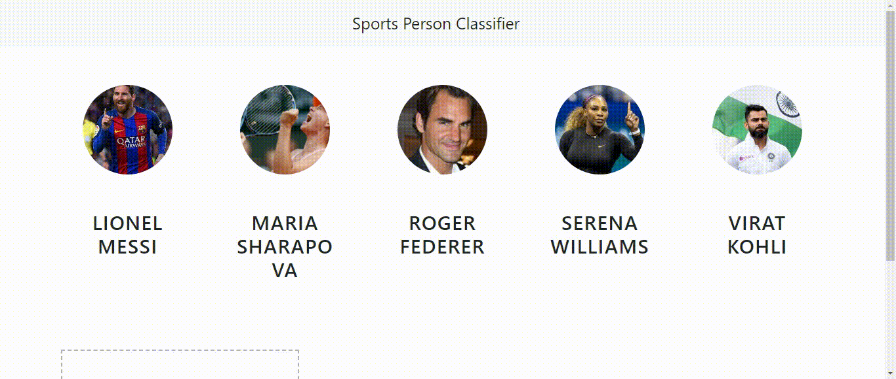

# Sports Celebrity Classification
> We humans recognize others by their faces, eyes etc whereas machines see them like a matrix of numbers. 
> 
> Here we are creating a ML model which identifies some celebrities by their faces and eyes based on its training with a good number of images of those celebrities. 

## Table of Contents
* [Goal](#goal)
* [Approach](#approach)
* [Features](#features)
* [Working](#working)
* [Project Status](#project-status)
* [Room for Improvement](#room-for-improvement)

* [Contact](#contact)
<!-- * [License](#license) -->
<!--5* [Setup](#setup)
* [Usage](#usage)-->
<!--8* [Acknowledgements](#acknowledgements)-->

## Goal
- Undestanding the simple Image classification principles
- Train a model to do that.
- Bring that model to a browser to real-time check.

## Approach
Our journey will have 3  major steps
- Model <ul><li>Identifying and extracting the faces of images using Haar XML</li><li>Training model to identify faces based on cropped faces of sports celebrities </li><li>Save that model as Pickle file</li></ul>
- Server <ul><li>Create a backend which will accept the image from UI</li><li>Use the saved model to identify that image</li><li>Return that celebrity name and a list of similarity values compared to all the Celebrities</li></ul>
- User Interface <ul><li>A webpage to drag and drop the test image</li><li>Image gets converted base 64 encoded string</li><li>Pass that string to our backend (Flask web server)</li></ul>

## Features
List the ready features here:
- Awesome feature 1
- Awesome feature 2
- Awesome feature 3

## Working

<!-- If you have screenshots you'd like to share, include them here. -->

<!--## Setup
What are the project requirements/dependencies? Where are they listed? A requirements.txt or a Pipfile.lock file perhaps? Where is it located?

Proceed to describe how to install / setup one's local environment / get started with the project.

## Usage
How does one go about using it?
Provide various use cases and code examples here.

`write-your-code-here`-->

## Project Status
Project is: _in progress_ / _complete_ / _no longer being worked on_. If you are no longer working on it, provide reasons why.

## Room for Improvement
Include areas you believe need improvement / could be improved. Also add TODOs for future development.

Room for improvement:
- Improvement to be done 1
- Improvement to be done 2

To do:
- Feature to be added 1
- Feature to be added 2

## Acknowledgements
Give credit here.
- This project was inspired by...
- This project was based on [this tutorial](https://www.example.com).
- Many thanks to...

## Contact
Created by [@flynerdpl](https://www.flynerd.pl/) - feel free to contact me!

<!-- Optional -->
<!-- ## License -->
<!-- This project is open source and available under the [... License](). -->

<!-- You don't have to include all sections - just the one's relevant to your project -->
